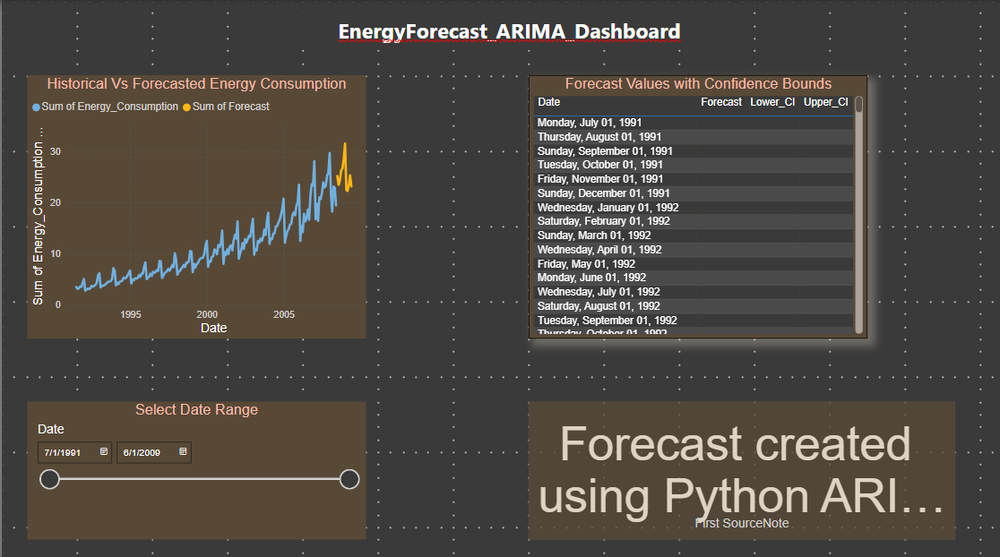

# ⚡ Energy Consumption Forecasting with ARIMA + Power BI + Azure

Predict monthly energy consumption using advanced time series modeling, visualized beautifully in **Power BI**, and ready for **Azure** automation.

---

## 📌 Overview

This project forecasts monthly energy usage using **Seasonal ARIMA (SARIMA)** models with automated hyperparameter tuning via `pmdarima`. The results are exported, visualized in Power BI, and structured to enable easy deployment to Azure for end-to-end automation.

---

## 🚀 Features

- ✅ **Time Series Forecasting** with Seasonal ARIMA
- 📈 Historical vs Forecast plots
- 📊 Power BI dashboard with:
  - Line chart (Historical + Forecast)
  - Table of forecast with confidence intervals
  - Interactive date slicer
  - Source card (data attribution)
- 💾 Auto-export of forecast results to CSV
- ☁️ Azure-ready structure
- 🔄 Seamless Git integration

---

## 🧠 Technologies Used

| Area | Tool |
|------|------|
| Forecasting | Python, pmdarima |
| Data Wrangling | pandas |
| Visualization | matplotlib, Power BI |
| Deployment Ready | Azure-compatible output |
| Version Control | Git + GitHub |

---

## 📂 File Outputs

After running the script:

```bash
📁 energy-forecast-arima/
├── energy_forecast.csv         # Combined forecast + historical
├── forecast_only.csv           # Forecasted values only
├── original_energy_data.csv    # Original dataset
├── energy_forecast_plot.png    # Forecast plot (with CI)
├── original_energy_consumption.png  # Historical plot
└── energy_forecast.pbix        # Power BI Dashboard

---

## 📊 Power BI Dashboard Features

🔷 Line Chart: Historical and forecast consumption

📅 Slicer: Filter data by date (dropdown or between)

📋 Table: Forecasted values + Lower/Upper confidence intervals

🧾 Source Note: Indicates the data comes from Python preprocessing

---

## 🛠️ Setup Instructions

📦 Requirements
Ensure Python 3.8+ and install dependencies:


```bash
pip install -r requirements.txt

▶️ Run Script

```bash
python energy_forecast_arima.py


---

## ☁️ Azure Integration

Outputs are structured for Azure Blob/Storage upload

Can be used as an automated pipeline via Azure Functions or Logic Apps

Future support: connect Power BI directly to Azure Blob + refresh


---

## ☁️ Azure Machine Learning Deployment

This project was successfully tested on Azure ML using:

- Workspace: `energy-ml-ws`
- Compute instance: `cpu-instance`
- Environment: `arima-env` (Python 3.10 + pmdarima)
- Forecasting script: `energy_forecast_arima.py`

---

## 💡 Notes

The script overwrites outputs on each run to avoid clutter

Power BI file (.pbix) reads directly from energy_forecast.csv

Use Git for version tracking and Azure for cloud automation

---

## 🤝 Contribution

Pull requests and ideas welcome! If this helps your workflow, star ⭐ the repo.

---

## 🪪 License

MIT License


## 🧾 Git Commands to Replace + Push Everything

Make sure you’re in the project root (`energy-forecast-arima/`) and all new files (Power BI, CSVs, updated Python scripts, etc.) are ready.

### ✅ Bash Commands:

```bash
# Optional: Clean old tracked files that should now be ignored
git rm -r --cached output/

# Pull latest changes in case others have pushed
git pull origin main

# Add all updated and new files
git add .

# Commit with a clear message
git commit -m "🔄 Updated forecasting script, Power BI file, and CSV outputs"

# Push to remote GitHub repo
git push origin main


---


